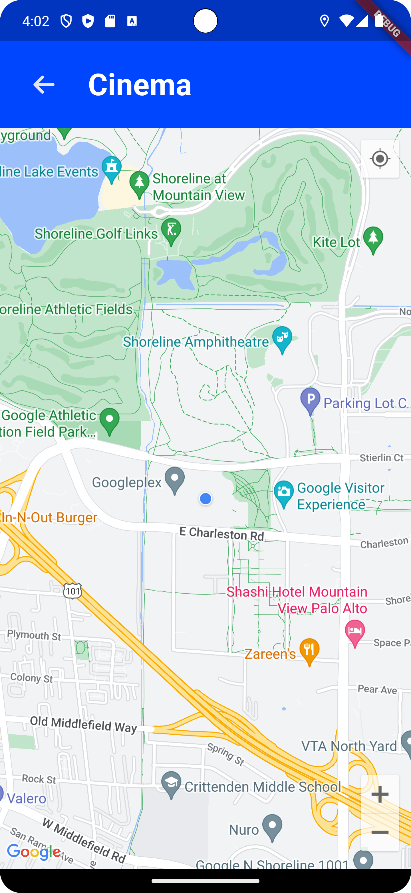
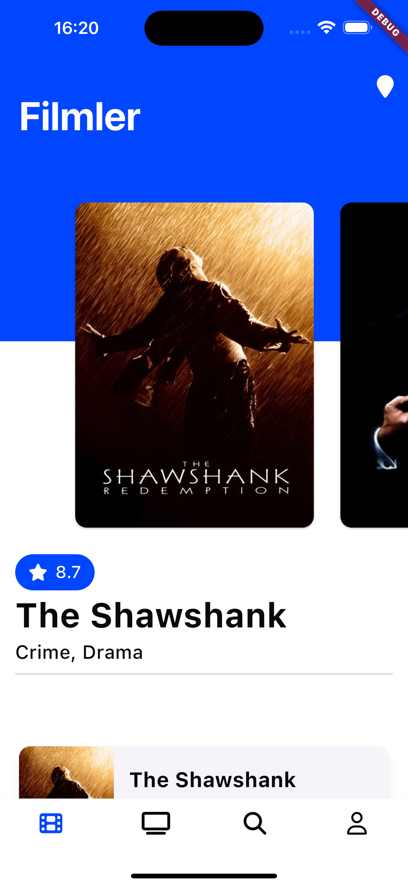
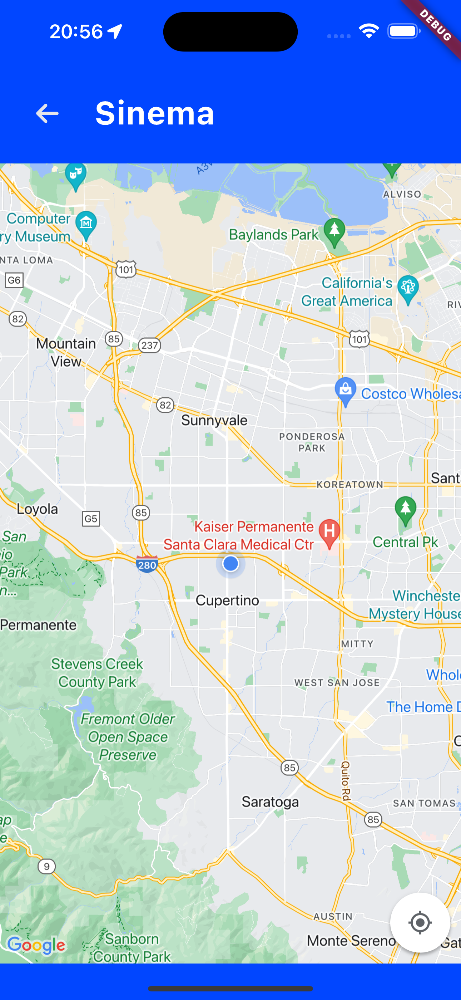

[](https://flutter.dev/)
# Flutter Sample App

This application is the Flutter Mobile sample app developed by Adesso Turkey. The primary objective of this project is to create a sample app for Flutter developers. This application consists of a sample architecture and codebase. The application encompasses a range of features, including the display of currently screening movies and TV series, the presentation of nearby movie theaters, and the ability to curate a personalized favorites list through integration with the TMBD movie API.

### Screenshots

#### Android

<div style="display: flex; width: 100%">
  
  
  
</div>

#### iOS

<div style="display: flex">
  
  
  
</div>

## Table of Contents

- [Setup Environment](#setup-environment)
- [API Key](#tmdb-api-key)
- [Architecture](#architecture)
- [Dependencies](#dependencies)
- [Branching Strategy](#branching-strategy)
- [License](#license)

## Development

### Setup Environment

**[Flutter Template](https://github.com/flutter/flutter/blob/master/docs/contributing/Setting-up-the-Framework-development-environment.md):** You can see how to set up the environment here.

### TMDB API Key

To run the application, you need to supply an API key from [TMDB](https://developers.themoviedb.org/3/getting-started/introduction). When you get the key, please add the following variable to the `.env` file in the root of the project:

```
API_KEY = Your TMDB API Key
```

### MAP API Key

To view Google Maps, you need to supply three API keys from [Google Web Services](https://developers.google.com/maps/documentation/places/web-service).

Add your API keys to `.env` accordingly:

```
# .env
GOOGLE_PLACES_API_KEY = <Google Places API Key>
GOOGLE_MAP_IOS_API_KEY = <Google Map iOS API Key>
GOOGLE_MAP_ANDROID_API_KEY = <Google Map Android Key>
```

## Architecture

- BLoC Pattern
- Localization
- Configuration
- Assets
- Freezed Data Classes

**View:** Renders UI and delegates user actions to Bloc. Each page is separated as a feature.

**Bloc:** Manages UI state and retrieves data from the data source asynchronously.

**Localization:** Holds text for various languages.

**Assets:** Contains assets like images.

**Freezed Data Classes:** Data classes are created with Freezed.

## Tech Stack

### Dependencies

- **[auto_route](https://pub.dev/packages/auto_route)** : Declarative routing for Flutter.
- **[dio](https://pub.dev/packages/dio)** : Powerful HTTP client for Dart.
- **[flutter_dotenv](https://pub.dev/packages/flutter_dotenv)** : Loads environment variables from a .env file.
- **[flutter](https://flutter.dev)** : Google's UI toolkit for building natively compiled applications for mobile, web, and desktop from a single codebase.
- **[flutter_bloc](https://pub.dev/packages/flutter_bloc)** : Implementation of the BLoC pattern for state management.
- **[flutter_localizations](https://api.flutter.dev/flutter/flutter_localizations/flutter_localizations-library.html)** : Localizations for Flutter's built-in widgets.
- **[freezed](https://pub.dev/packages/freezed)** : Code generation for unions/pattern-matching/copy in Dart.
- **[formz](https://pub.dev/packages/formz)** : Simplifies form validation.
- **[geolocator](https://pub.dev/packages/geolocator)** : Provides geolocation functionalities.

## Branching Strategy

Gitflow is a legacy Git workflow that was originally a disruptive and novel strategy for managing Git branches. Gitflow has fallen in popularity in favor of trunk-based workflows, which are now considered best practices for modern continuous software development and DevOps practices. Gitflow can also be challenging to use with CI/CD.

| Branch      | Description                                                                                                                                                                                                                                                                             |
|-------------|-----------------------------------------------------------------------------------------------------------------------------------------------------------------------------------------------------------------------------------------------------------------------------------------|
| **Main**    | In the Git flow workflow, the main branch is used to store code that is release-ready and ready for production.                                                                                                                                                                         |
| **Develop** | The develop branch contains pre-production code with recently built features that are currently being tested. It is established at the beginning of a project and maintained during the development process.                                                                            |
| **Feature** | You will create a feature branch off the develop branch while working on a new feature, and once it has been finished and carefully reviewed, you will merge your changes into the develop branch.                                                                                      |
| **Hotfix**  | The hotfix branch is utilized in the Git pipeline to swiftly address required changes in your main branch. Your main branch should serve as the base for the hotfix branch, and it should be merged back into both the main and develop branches.                                       |
| **Release** | The release branch should be used when preparing new production releases. Typically, the work being performed on release branches concerns finishing touches and minor bugs specific to releasing new code, with code that should be addressed separately from the main develop branch. |

- Branch names should start with feature, hotfix, or release according to the purpose of the branch, followed by the ticket ID. For example: `feature/SASU-1234_some-issue`
- Pull requests should refer to specific issues with the ticket ID. For example: `[SASU-1234] - New feature`
- Merge strategy: Rebase and merge is preferred for maintaining a linear project history.

## Join the Crew!

[Act now to join](https://www.linkedin.com/company/adessoturkey/jobs/) our team and become an adessi — enjoy a Great Place to Work!

## License

```
Copyright 2023 adesso Turkey

Licensed under the Apache License, Version 2.0 (the "License");
you may not use this file except in compliance with the License.
You may obtain a copy of the License at

    http://www.apache.org/licenses/LICENSE-2.0

Unless required by applicable law or agreed to in writing, software
distributed under the License is distributed on an "AS IS" BASIS,
WITHOUT WARRANTIES OR CONDITIONS OF ANY KIND, either express or implied.
See the License for the specific language governing permissions and
limitations under the License.
```